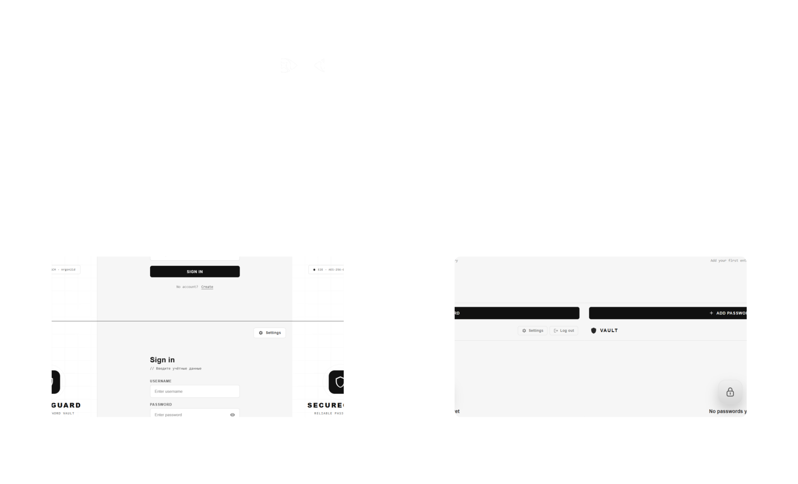

<h1 align="center">SecureGuard</h1>

<p align="center">
  <a href="./README.md">English</a> |
  <a href="./README.ru.md"><strong>Русский</strong></a>
</p>

<p align="center">
  
</p>

<p align="center">
  <i>Windows-first desktop password vault с локальным шифрованием, hardening-интеграциями ОС и Go gRPC backend.</i>
</p>

<p align="center">
  <a href="./LICENSE"></a>
  
  
  <br />
  <a href="https://github.com/Aesterial/SecureGuard/actions/workflows/go-link-static.yml"></a>
  <a href="https://github.com/Aesterial/SecureGuard/actions/workflows/rust-link-static.yml"></a>
</p>

## Обзор

`SecureGuard` - это монорепозиторий десктопного менеджера паролей из трех основных частей:

- `client/`: Tauri-приложение (`Rust + HTML/CSS/JS`)
- `server/`: Go gRPC backend со слоистой структурой `domain/app/infra`
- `api/`: protobuf-контракты и входы для генерации Go- и Rust-клиентов

Сейчас репозиторий находится на стадии активного MVP. Десктопное приложение уже закрывает основной vault flow, а backend держит более широкую API-поверхность для сессий, настроек, метаданных и admin-статистики.

## Документация

Материалы проекта для разработки и презентации:

- [docs/PROJECT_DOCS.md](./docs/PROJECT_DOCS.md) - полная документация проекта
- [docs/USER_FAQ.md](./docs/USER_FAQ.md) - FAQ для пользователей
- [api/README.md](./api/README.md) - заметки по protobuf и генерации

## Текущее состояние

### Десктопный клиент

- Регистрация и логин через gRPC
- Локальная генерация vault-key envelope из seed phrase до регистрации
- Локальное шифрование паролей до отправки на backend
- Поддерживаемые режимы шифрования:
  - `AES-256-GCM + Argon2id`
  - `AES-256-GCM + SHA-256`
- Vault flow для паролей:
  - создание записей
  - просмотр списка
  - удаление
  - расшифровка и копирование через seed phrase
- Staff-only read-only экран статистики
- Автоочистка буфера обмена с таймаутом `30s` по умолчанию и настраиваемыми пресетами
- Интерфейс на RU/EN
- Локальные настройки UI:
  - язык
  - алгоритм шифрования
  - защита от скриншотов
  - светлая тема
  - автозапуск с Windows
  - таймер авторазлогина
  - таймаут буфера обмена
  - подтверждение удаления
  - блокировка context menu
- Windows-специфичные интеграции для screenshot protection, автозапуска и release-only защит

### Backend и API

- gRPC-сервисы, регистрируемые в `server/starter/start.go`:
  - `MetaService`
  - `LoginService`
  - `UserService`
  - `PasswordService`
  - `StatsService`
  - `SessionsService`
- PostgreSQL persistence через `sqlc`
- Session-based authentication с привязкой по client metadata и background worker для cleanup
- Опциональный Redis-backed rate limiting для register/login/meta endpoint'ов
- Structured logging subsystem
- Опциональный Kafka-backed transport логов и log reader
- Hourly и daily workers для сохранения статистики
- Buf-based генерация protobuf-кода для Go и Rust
- GitHub Actions workflows для Go и Rust link/static analysis

### Текущие ограничения

- Десктопный клиент сейчас сфокусирован на аутентификации, vault management, настройках и staff-статистике.
- UI пока не раскрывает password updates, session management и key rotation, хотя backend/API для части этих сценариев уже есть.
- Экран admin-статистики зависит от Kafka log reader path. В минимальной локальной конфигурации с `KAFKA_ENABLED=false` staff analytics недоступна.
- Во время регистрации сервер не получает raw seed phrase. Он хранит wrapped master key вместе с salt/KDF params в `users_keys`, поэтому текущий дизайн безопаснее старого, но это все еще не strict zero-knowledge vault.
- Репозиторий ориентирован в первую очередь на Windows. В Tauri-клиенте есть Windows-only интеграции для screenshot protection и управления автозапуском.

## Структура репозитория

```text
SecureGuard/
|-- client/
|   |-- src/                # Frontend HTML/CSS/JS
|   |-- src-tauri/          # Tauri shell, crypto, OS integrations
|   `-- grpc/               # Сгенерированные Rust gRPC stubs
|-- server/
|   |-- internal/           # Domain, app, infra, сгенерированные Go stubs
|   |-- starter/            # Entry point для bootstrap gRPC-сервера
|   `-- migrations/         # Схема и sqlc queries
|-- api/
|   |-- xyz/secureguard/... # Protobuf-контракты
|   `-- third_party/        # Proto-зависимости
|-- docs/                   # Документация проекта и FAQ
|-- run.bat                 # Основной локальный helper-скрипт для Windows
`-- .github/                # CI workflows и repository assets
```

## Требования

- Windows 10/11
- `Rust` stable
- `Node.js` с `npm`
- `Go 1.26.1` или совместимая версия по `go.mod`
- `Docker`, если хотите, чтобы `run.bat` сам поднимал PostgreSQL
- `Git` с поддержкой submodules

## Быстрый старт

1. Клонируйте репозиторий:

```bash
git clone https://github.com/Aesterial/SecureGuard.git
cd SecureGuard
```

2. Инициализируйте protobuf-зависимости:

```bash
git submodule update --init --recursive api/third_party/googleapis api/third_party/grpc-web
```

3. Установите frontend-зависимости:

```bash
cd client
npm ci
cd ..
```

4. Настройте backend environment:

```powershell
Copy-Item server/starter/.env.example server/starter/.env
```

Обновите `server/starter/.env`, чтобы десктопный клиент и backend использовали один и тот же порт:

```env
POSTGRES_HOST=127.0.0.1
POSTGRES_PORT=5432
POSTGRES_USER=postgres
POSTGRES_PASSWORD=postgres
POSTGRES_NAME=secureguard
POSTGRES_TLS=false

BOOT_PORT=8080
LOG_SERVICE=secureguard
LOG_LEVEL=info
KAFKA_ENABLED=false
DEBUG_MODE=false
```

Почему `8080`: Tauri-клиент по умолчанию ходит на `http://127.0.0.1:8080` в `client/src-tauri/src/api.rs`.

Примечания:

- `server/starter/.env.example` теперь ориентирован на локальный desktop flow и по умолчанию держит Kafka analytics и Redis rate limiting выключенными.
- Корневой `docker compose` stack по-прежнему включает Kafka и rate limiting своими container defaults, так что для минимальной локальной разработки вручную это включать не нужно.
- Для минимального desktop flow хватает облегченной конфигурации выше, но staff analytics в ней не будет.

5. Запустите все через helper-скрипт:

```bat
run.bat
```

`run.bat` умеет:

- останавливать ранее запущенные процессы приложения
- создавать `server/starter/.env`, если файла нет
- запускать PostgreSQL в Docker, если локально он не поднят
- применять `server/migrations/scheme/sqlc.sql`
- стартовать Go gRPC backend
- запускать Tauri-приложение в `dev` или `build` режиме

## Docker Compose

Для полного backend stack с аналитикой и reverse proxy используйте корневой Docker stack:

```bash
docker compose up --build
```

Этот stack поднимает:

- `db`: PostgreSQL 16
- `redis`: storage для rate limit
- `kafka`: transport логов и source для analytics reader
- `backend`: Go gRPC сервис из `server/starter`
- `caddy`: публичный reverse proxy с автоматическим TLS

Примечания:

- Caddy открывает порты `80/443` и проксирует h2c-трафик в backend на порт `50051`.
- Контейнер backend ждет PostgreSQL, применяет `server/migrations/scheme/sqlc.sql`, а затем стартует gRPC-сервер.
- В этом stack backend по умолчанию запускается с `KAFKA_ENABLED=true` и `RATE_LIMIT_ENABLED=true`.
- Данные БД пишутся в именованный volume `secureguard-postgres-data`.
- Данные Redis и Kafka тоже сохраняются в именованные Docker volumes.
- Caddy хранит ACME state в persistent Docker volumes.
- Закоммиченный `Caddyfile` является шаблоном для публичного деплоя и использует плейсхолдеры `example.com`, `www.example.com` и `admin@example.com`. Перед деплоем замените их на реальные значения.

## Ручная разработка

### 1. Запустите PostgreSQL

```bash
docker run --name secureguard-postgres -e POSTGRES_USER=postgres -e POSTGRES_PASSWORD=postgres -e POSTGRES_DB=secureguard -p 5432:5432 -d postgres:16-alpine
```

Этого достаточно для базового vault flow. Если локально нужны staff analytics или rate limiting, лучше использовать корневой `docker compose`, чтобы были доступны `Redis` и `Kafka`.

### 2. Примените схему

```bash
docker exec -i secureguard-postgres psql -U postgres -d secureguard < server/migrations/scheme/sqlc.sql
```

### 3. Запустите backend

```bash
cd server/starter
go run .
```

### 4. Запустите desktop app

```bash
cd client
npm run dev
```

Если хотите держать backend на другом порту, перед запуском клиента экспортируйте одну из переменных:

- `SECUREGUARD_GRPC_ENDPOINT`
- `SECUREGUARD_BACKEND`

Пример:

```powershell
$env:SECUREGUARD_GRPC_ENDPOINT = "http://127.0.0.1:50051"
cd client
npm run dev
```

## Локальные проверки качества

### Go

```bash
cd server/internal
go test ./...

cd ../starter
go test ./...
```

### Rust

```bash
cd client/src-tauri
cargo fmt --all -- --check
cargo clippy --all-targets --all-features -- -D warnings
cargo build --all-targets --all-features --locked
```

Эти команды соответствуют текущим CI workflow в `.github/workflows/go-link-static.yml` и `.github/workflows/rust-link-static.yml`.

## API и генерация кода

Полные детали генерации смотрите в [api/README.md](./api/README.md).

Короткая версия:

1. Установите генераторы:

```bash
go install google.golang.org/protobuf/cmd/protoc-gen-go@latest
go install google.golang.org/grpc/cmd/protoc-gen-go-grpc@latest
cargo install protoc-gen-prost
cargo install protoc-gen-tonic
```

2. Убедитесь, что бинарники генераторов лежат в `PATH`:

- Go: `%USERPROFILE%\go\bin`
- Rust: `%USERPROFILE%\.cargo\bin`

3. Сгенерируйте код:

```bash
cd api
buf generate
```

Результат генерации:

- Go stubs: `server/internal/api/...`
- Rust stubs: `client/grpc/...`

## Вклад

- Используйте владельцев из `CODEOWNERS` при маршрутизации ревью.
- Следуйте [CONTRIBUTING.md](./CONTRIBUTING.md).
- Придерживайтесь правил коммитов из `.github/COMMIT_STYLE.md`.
- Старайтесь держать изменения сфокусированными на одной области.
- Если меняете protobuf-контракты, добавляйте обновленные generated files в той же ветке.

## Лицензия

Проект распространяется под [GNU AGPL-3.0](./LICENSE).
